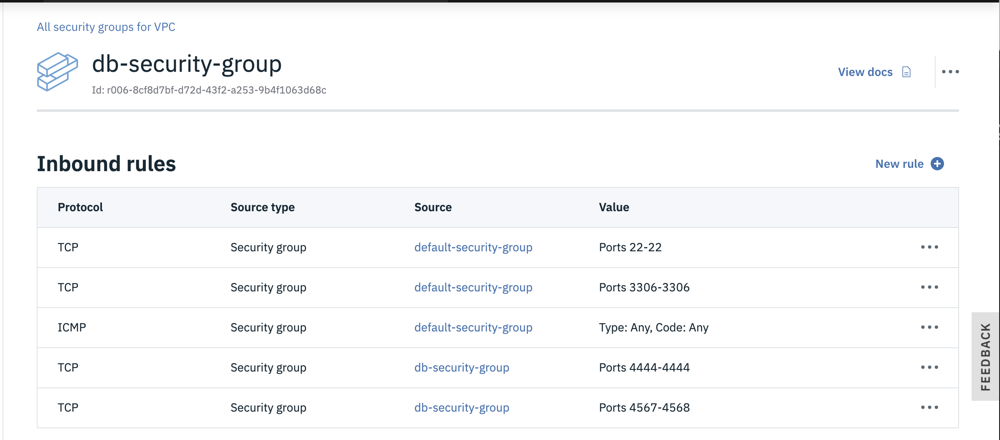
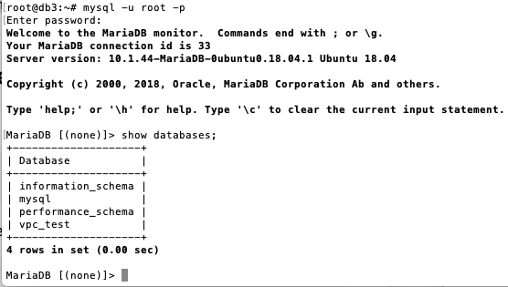
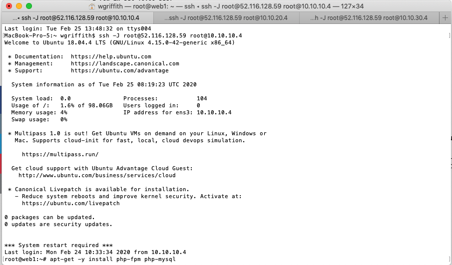

# Install Wordpress in an active-active highly available configuration

The following section will be done using the Linux command line interface via an SSH connection. 

https://cloud.ibm.com/docs/tutorials?topic=solution-tutorials-highly-available-and-scalable-web-application#php_application

## Setting up a MariaDB Galera Cluster
As Wordpress depends on a database, we will start bottom-up to simplify dependencies.

TODO:  blurb about Galera

### 1. Install MariaDB on the Database Servers
1.  Open three terminals and connect to each database server (e.g. ``db1``) via ssh.  
	```
	# ssh -J root@<jump_server> root@<db_server>
	ssh -J root@52.116.128.59 root@10.10.11.4
	ssh -J root@52.116.128.59 root@10.10.21.4
	ssh -J root@52.116.128.59 root@10.10.31.4
	```  
	

2.  Install the MariaDB 10.3 database on each ``db`` VSI.  
	```
	apt-get update
	apt-get install mariadb-server mariadb-client galera
	```  

3. Configure Galera settings on each DB server.  
	```
	vim /etc/mysql/mariadb.conf.d/50-server.cnf
	# Add the following configuration values below [mysqld]
	# Galera Cluster configurations (https://mariadb.com/kb/en/configuring-mariadb-galera-cluster/)
	wsrep_on = ON
	wsrep_provider = /usr/lib/galera/libgalera_smm.so
	wsrep_cluster_address = "gcomm://10.10.11.4,10.10.21.4,10.10.31.4"
	default_storage_engine = InnoDB
	binlog_format = row
	innodb_autoinc_lock_mode = 2
	innodb_force_primary_key = 1
	innodb_doublewrite = 1
	# listen on all IPv4 interfaces
	bind-address           = 0.0.0.0
	```  

4. Open security group ports for Galera replication.  
	* Open TCP port ``4444`` for any node of the ``db-security-group``.
	* Open TCP ports ``4567-4568`` for any node of the ``db-security-group``.

		

5. Start a new Galera cluster on your primary DB node (e.g. ``db1``).  
	```
	systemctl stop mariadb
	galera_new_cluster

	# login mysql (default password is blank) and check cluster size
	mysql -u root -p

	# run mysql command
	show status like 'wsrep_cluster_size';
	```  
	

6.  Join Galera cluster on remaining DB nodes.  
	```
	# simply restarting mariadb will join the cluster since the config file tells this node where
	systemctl restart mariadb
	# on any of the nodes, run the mysql command
	show status like 'wsrep_cluster_size';
	```
	

7. Verify Galera cluster is replicating.  
	```
	mysql -u root -p
	create database vpc_test;

	# from a different node
	mysql -u root -p
	show databases;
	```
	
			

### 2. Configure MariaDB Galera cluster for Wordpress
1.  Enable MariaDB at server boot time on all ``db`` servers.  
	```
	systemctl enable mariadb.service
	```

2.  Update security of MariaDB on all ``db`` servers.  
	```
	mysql_secure_installation
	```
	* root password = mariaL0vesVPC
	* remove anonymous users = Y
	* disallow root login remotely = n
	* remove test database = Y
	* reload priviledge tables now = Y

3.  Create a database for ``Wordpress`` on any of the ``db`` server nodes.  
	```
	mysql -u root -p
	CREATE DATABASE wordpress;
	# TODO:  can we use wp_admin instead of root?
	GRANT ALL ON wordpress.\* TO root@'10.10.%.%' IDENTIFIED BY 'mariaL0vesVPC' WITH GRANT OPTION;
	FLUSH PRIVILEGES;
	show databases;
	EXIT;
	```

## Setting up Application Servers for Wordpress
We will use NGinx as the web server with PHP for the application server functionality.

### 1. Install PHP libraries
You could use the ``user-data`` field while provisioning the VSIs to do many of these steps during VSI provisioning (you could also burn an image from one VSI once it had been installed and configured as desired), but this tutorial walks thru the steps from scratch so you can see what is going on and to make debugging much easier should you run into errors during the process.  

1.  Open three terminals and connect to each web server (e.g. ``web1``) via ssh.  
	```
	# ssh -J root@<jump_server> roott@<web_server>
	ssh -J root@52.116.128.59 root@10.10.10.4
	ssh -J root@52.116.128.59 root@10.10.20.4
	ssh -J root@52.116.128.59 root@10.10.30.4
	```
	

2.  Update PHP libraries on all ``web`` servers.  
	```
	apt-get update -y
	apt-get upgrade -y
	#  keep local version of /etc/ssh/sshd_config
	apt-get -y install php-fpm php-mysql
	#  common libraries needed for wordpress
	apt install -y php-curl php-gd php-intl php-mbstring php-soap php-xml php-xmlrpc php-zip 
	php -v  # to confirm 7.2+ is installed
	# stop php and nginx
	systemctl stop php7.2-fpm  
	systemctl stop nginx
	```

3.  Configure NGinx for PHP on each ``web`` server.  
* Modify the default nginx configuration (e.g. ``vi /etc/nginx/sites-available/default``).
* Add index.php to list of startup pages.  
	```
	index index.php index.html index.htm index.nginx-debian.html;
	```

* Uncomment FastCGI server config and change php to 7.2.  
	```
	location ~ \.php$ {
		include snippets/fastcgi-php.conf;
		fastcgi_pass unix:/run/php/php7.2-fpm.sock;
	}
	```

* Uncomment .ht stanza to deny access.  
	```
	location ~ /\.ht {
		deny all;
	}
	```

* Verify NGinx config.  
	```
	nginx -t
	```

* Ensure nginx and php-fpm are started.  
	```
	systemctl start nginx
	systemctl reload nginx
	systemctl start php7.2-fpm
	```

### 2. Test PHP from NGinx
* Create a php page on each ``web`` server.  
	```
	echo "<?php phpinfo(); ?>" > /var/www/html/info.php
	# test PHP
	curl localhost/info.php | head -20
	```

### 3. Install GlusterFS
We will use GlusterFS (link?) to provide an active-active disk cluster for our Wordpress files so we can tolerate a complete data-center outage without loss of data or availability.

1.  Install glusterFS on each ``web`` server.  
	```
	apt update
	apt upgrade -y
	add-apt-repository -y ppa:gluster/glusterfs-7  
	apt install -y glusterfs-server
	```
2.  Mount local disk for glusterFS
You first need to create an ``xfs`` filesystem on the disk that is attached to the ``web`` server.  
	```
	# find your disk
	lsblk
	```
TODO:  (image)
* Format the disk using the ``xfs`` filesystem type.  
	```
	mkfs.xfs /dev/vdb
	```
* Mount the disk
	```
	mkdir -p /gluster/wordpress
	echo '/dev/vdb /gluster/wordpress xfs defaults 0 0' >> /etc/fstab
	mount -a
	mkdir -p /gluster/wordpress/brick01
	```  
* Change brick name to match server number (e.g. brick02 for ``web2``).
* Repeat this step on all ``web`` servers.

3. Configure Gluster  
	```
	systemctl enable glusterd
	```

4. Add nodes to trusted storage pool from **one** node only.
	```
	gluster peer probe 10.10.20.4
	gluster peer probe 10.10.30.4
	# verify peer trust
	gluster peer status
	```  
	

5. Create Gluster Volume from **one** node only.  
	```
	gluster volume create wordpress-vol replica 3 \
	10.10.10.8:/gluster/wordpress/brick01 \
	10.10.20.8:/gluster/wordpress/brick02 \
	10.10.30.7:/gluster/wordpress/brick03
	# start the volume
	gluster volume start wordpress-vol
	root@web1:~# gluster volume status wordpress-vol
	Status of volume: wordpress-vol
	Gluster process                             TCP Port  RDMA Port  Online  Pid
	------------------------------------------------------------------------------
	Brick 10.10.10.8:/gluster/wordpress/brick01
	/volume                                     49152     0          Y       20032
	Brick 10.10.20.8:/gluster/wordpress/brick02
	/volume                                     49152     0          Y       19315
	Brick 10.10.30.7:/gluster/wordpress/brick03
	/volume                                     49152     0          Y       19023
	Self-heal Daemon on localhost               N/A       N/A        Y       20053
	Self-heal Daemon on 10.10.20.8              N/A       N/A        Y       19336
	Self-heal Daemon on 10.10.30.7              N/A       N/A        Y       19044
	
	Task Status of Volume wordpress-vol
	------------------------------------------------------------------------------
	There are no active volume tasks
	```
* TODO:  Open ports for Gluster replication in security-group.

* Only allow ``web`` nodes to mount the Gluster volume.   
	```
	gluster volume set wordpress-vol auth.allow 10.10.10.8,10.10.20.8,10.10.30.7
	```

6. Mount the GlusterFS volume locally
	```
	# stop nginx
	systemctl stop nginx
	mv /var/www/html{,.orig}
	mkdir /var/www/html
	echo 'localhost:/wordpress-vol /var/www/html glusterfs defaults,\_netdev 0 0' >> /etc/fstab
	mount -a
	df -h
	```

7. Test Gluster replication from one ``web`` server node.  
	```
	echo 'Hello Gluster!' > /var/www/html/index.html
	systemctl start nginx
	curl localhost
	```

### 4. Install Wordpress  
Since GlusterFS will replicate ``/var/www/html`` to all of the ``web`` servers, you only need to install it once.
1.  Download and install Wordpress on one of the ``web`` servers.  
	```
	cd /tmp && wget https://wordpress.org/latest.tar.gz
	tar -xvf /tmp/latest.tar.gz 
	cp -r /tmp/wordpress/\* /var/www/html/
	rm -rf /tmp/wordpress
	rm -rf /tmp/latest.tar.gz
	chown -R www-data:www-data /var/www/html/wp-content
	chmod -R 755 /var/www/html/wp-content
	mv /var/www/html/wp-config-sample.php /var/www/html/wp-config.php
	```

2.  Add a **private** load balancer in front of the DB nodes.  
* use TCP 3306
* update DB-security-group rule to allow any 10.10.0.0/16 connection

3. Configure Wordpress to point to db servers
	* get wordpress secret-keys using ``# curl  https://api.wordpress.org/secret-key/1.1/salt/``
	* copy them into wp-config.php
	* edit ``/var/www/html/wp-config.php`` and set the DB parameters
	```
	define('DB_NAME', 'wordpress');
	define('DB_USER', 'root');  # TODO:  can I use db_admin
	define('DB_PASSWORD', 'mariaL0vesVPC');
	define('DB_HOST', 'a48471e6-us-south.lb.appdomain.cloud'); # use private load balancer
	#define('FS_METHOD', 'direct');  # TODO:  do I need this?

	# TODO: test wordpress without doing wp-config.php by copying config file form wordpress home page
	#https://www.udemy.com/course/aws-certified-solutions-architect-associate/learn/lecture/13887868#overview
	```

4.  Start nginx
	```
	systemctl start nginx
	systemctl reload nginx
	systemctl start php7.2-fpm
	```

5. Test application configuration
http://floatingIP/wordpress
* configure language
* add user/password
* add wordpress title
* screenshot

Congratulations!!!  You have successfully installed WordPress on a multi-VSI VPC configuration.

## Configure High Availability

### 1. Provision a cross-zone Load Balancer

### 2. Configure health-checks

### 3. Test data-center failure

### 4. Configure database replication

### 5. Test DB failover


8.  NFS for DB?  Backups?
https://cloud.ibm.com/docs/tutorials?topic=solution-tutorials-highly-available-and-scalable-web-application#database_backup
* backups seem old-school... can I setup replication instead?
	* maybe backups to COS to show COS
* https://cloud.ibm.com/docs/tutorials?topic=solution-tutorials-highly-available-and-scalable-web-application#configure-regular-snapshots

